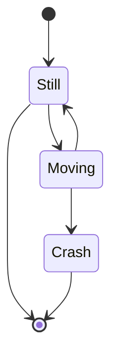
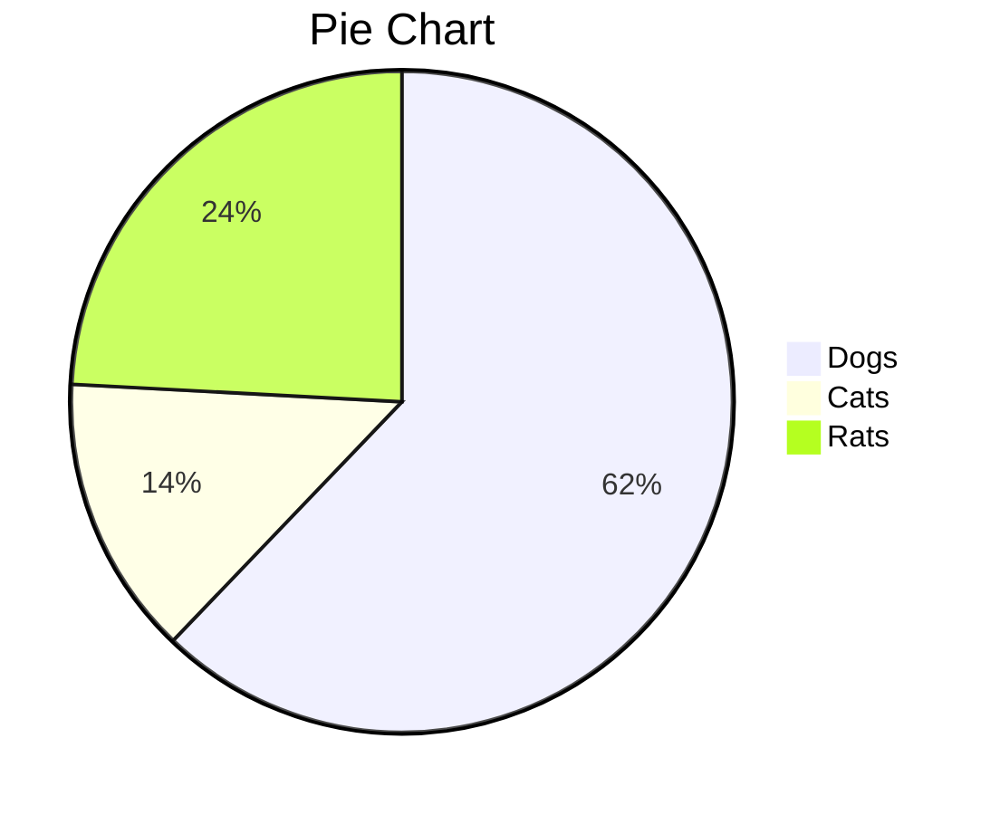

Typora supports some Markdown extensions for diagrams, once they are enabled from preference panel. 

When exporting as HTML, PDF, epub, docx, those rendered diagrams will also be included, but diagrams features are not supported when exporting markdown into other file formats in current version. Besides, you should also notice that diagrams is not supported by standard Markdown, CommonMark or GFM. Therefore, we still recommend you to insert an image of these diagrams instead of write them in Markdown directly.

# Sequence Diagrams

This feature uses [js-sequence](https://bramp.github.io/js-sequence-diagrams/), which turns the following code block into a rendered diagram:

~~~gfm
```sequence
Alice->Bob: Hello Bob, how are you?
Note right of Bob: Bob thinks
Bob-->Alice: I am good thanks!
​```
~~~


For more details, please see [this syntax explanation](https://bramp.github.io/js-sequence-diagrams/#syntax).

# Flowcharts

This feature uses [flowchart.js](http://flowchart.js.org/), which turns the following code block into a rendered diagram:

~~~gfm
```flow
st=>start: Start
op=>operation: Your Operation
cond=>condition: Yes or No?
e=>end

st->op->cond
cond(yes)->e
cond(no)->op
​```
~~~


# Mermaid

Typora also has integration with [mermaid](https://knsv.github.io/mermaid/#/), which supports sequence diagrams, flowcharts, Gantt charts, class and state diagrams, and pie charts. 

## Sequence Diagrams

For more details see [these instructions](https://mermaid-js.github.io/mermaid/#/sequenceDiagram).

~~~gfm
```mermaid
%% Example of sequence diagram
  sequenceDiagram
    Alice->>Bob: Hello Bob, how are you?
    alt is sick
    Bob->>Alice: Not so good :(
    else is well
    Bob->>Alice: Feeling fresh like a daisy
    end
    opt Extra response
    Bob->>Alice: Thanks for asking
    end
​```
~~~


## Flowcharts

For more details see [these instructions](https://mermaid-js.github.io/mermaid/#/flowchart).

~~~gfm
```mermaid
graph LR
A[Hard edge] -->B(Round edge)
    B --> C{Decision}
    C -->|One| D[Result one]
    C -->|Two| E[Result two]
​```
~~~


## Gantt Charts

For more details see [these instructions](https://mermaid-js.github.io/mermaid/#gantt).

~~~gfm
```mermaid
%% Example with selection of syntaxes
        gantt
        dateFormat  YYYY-MM-DD
        title Adding GANTT diagram functionality to mermaid

        section A section
        Completed task            :done,    des1, 2014-01-06,2014-01-08
        Active task               :active,  des2, 2014-01-09, 3d
        Future task               :         des3, after des2, 5d
        Future task2               :         des4, after des3, 5d

        section Critical tasks
        Completed task in the critical line :crit, done, 2014-01-06,24h
        Implement parser and jison          :crit, done, after des1, 2d
        Create tests for parser             :crit, active, 3d
        Future task in critical line        :crit, 5d
        Create tests for renderer           :2d
        Add to mermaid                      :1d

        section Documentation
        Describe gantt syntax               :active, a1, after des1, 3d
        Add gantt diagram to demo page      :after a1  , 20h
        Add another diagram to demo page    :doc1, after a1  , 48h

        section Last section
        Describe gantt syntax               :after doc1, 3d
        Add gantt diagram to demo page      : 20h
        Add another diagram to demo page    : 48h
​```
~~~


## Class Diagrams

For more details see [these instructions](https://mermaid-js.github.io/mermaid/#/classDiagram).

~~~gfm
```mermaid
classDiagram
      Animal <|-- Duck
      Animal <|-- Fish
      Animal <|-- Zebra
      Animal : +int age
      Animal : +String gender
      Animal: +isMammal()
      Animal: +mate()
      class Duck{
          +String beakColor
          +swim()
          +quack()
      }
      class Fish{
          -int sizeInFeet
          -canEat()
      }
      class Zebra{
          +bool is_wild
          +run()
      }
```
~~~


## State Diagrams

For more details see [these instructions](https://mermaidjs.github.io/#/stateDiagram).

~~~gfm

~~~


## Pie Charts

~~~gfm

~~~


