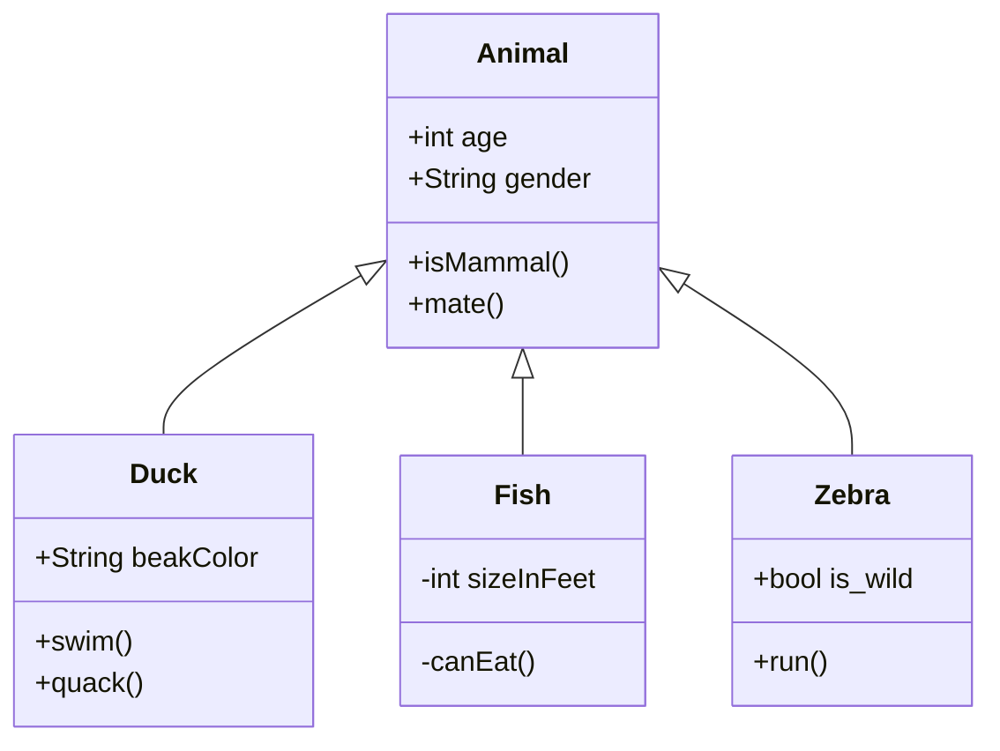
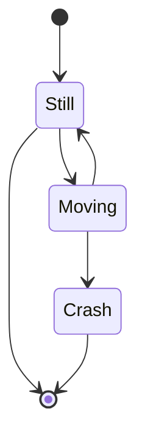
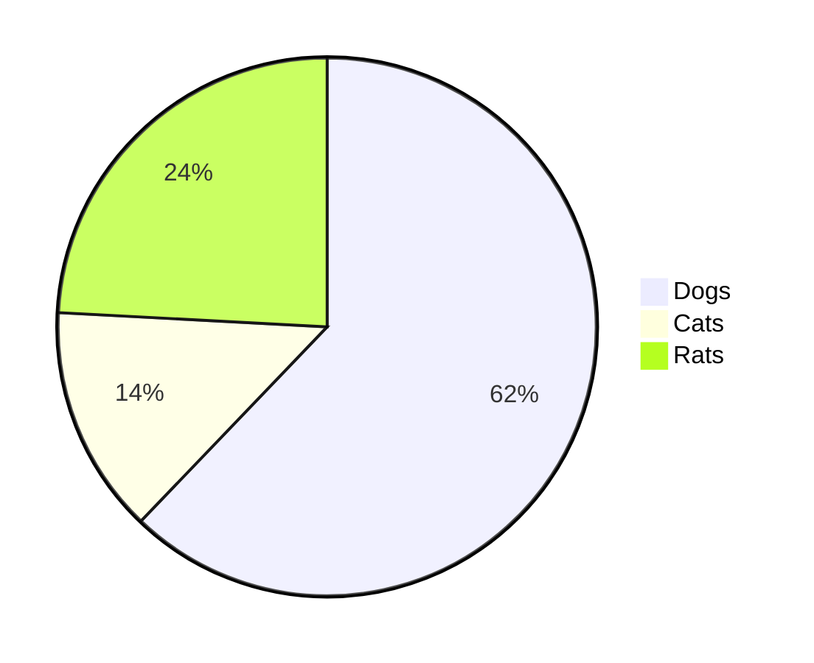

# New / Improvement

#### New Mermaid Diagrams

We upgraded our Mermaid library, now new diagrams are supported:

##### [Class Diagram](https://mermaidjs.github.io/#/classDiagram)

##### [State Diagram](https://mermaidjs.github.io/#/stateDiagram)

##### [Pie Chart Diagrams](https://mermaidjs.github.io/#/pie?id=pie-chart-diagrams)

Besides the new diagrams, there are also a few bug fix:

- Fix XSS on mermaid diagrams.
- Fix text incomplete or misaligned on devices with higher DPI.
- Fix mermaid diagrams not included in exported `.docx` file.

#### Support for new languages

- Add **Danish** translation by [archfrog](https://github.com/archfrog).
- Add **Ukrainian** translation by [oleksavyshnivsky](https://github.com/oleksavyshnivsky).
- Updates on other translations as well, including Japanese, Polish, Czech, etc

To contribution on the i18n of Typora, please checkout https://github.com/typora/Typora-i18n

## Bug Fix

#### Find & Replace

- Distinguish `Find` and `Find Next` command. Selection will not be changed when open find panel by `Find` command.
- Fix incorrect text selection after `Replace` command.
- Use higher contrast for search result in `Night` theme. 

#### Spellcheck

- Fix spellcheck on `sub` or `sup` texts, instead of treating text and following `sub` or `sup` as one word.
- Fix spellcheck for words with symbols, such as `don't`, instead of treating them as two words.

#### Stability

- Fix compatibility issues with Sougo IME on Windows.
- Fix PDF export crash when using system IME on macOS.

#### Copy & Paste

- Fix whitespace will be inserted when paste link from website.
- Improve speed when paste large content.
- Improve the logic of converting web HTML into Markdown when pasting into Typora.

####  Export

- Prevent unintended ligatures in generated PDF.
- PDF Export will respect `Page Setup...` on macOS.
- Fix mermaid not exported in docx.
- Fix internal links not working on exported PDF.
- Fix anchor link in exported HTML.

#### Others

- Improve natural sort logic on files tab.
- When making links, relative links in clipboard will also be auto filled.
- Improve auto pair logic for quotes.
- Improve navigation keys behavior.
- Improve lists on Typora.