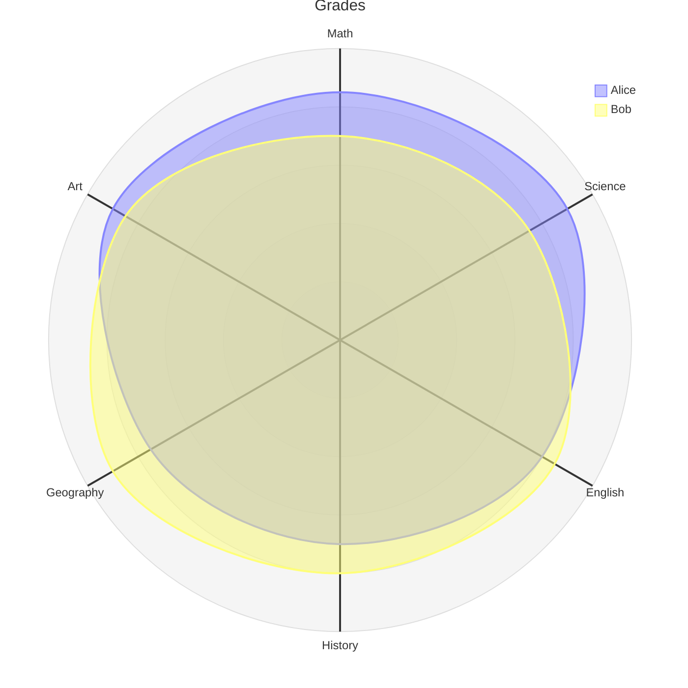
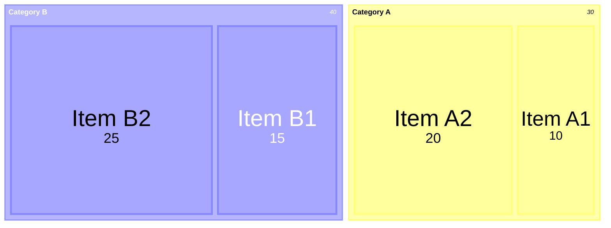

* Outline
{:toc}


## New

### LaTeX delimiters for math

Previously, Typora supports `$` and `$$` for triggering inline and block math modes. However, other systems, like ChatGPT or LMS predominantly utilize `\(` and `\)` for inline math, and `\[` and `\]` for block math. 

To improve the compatibility with our Markdown syntax, now, LaTeX delimiters are supported by Typora after enable it in preferences panel (which requires restart Typora to apply).


Here are the examples:

|                                 | **Markdown Code**                                            | **Markdown Preview**                                         |
| ------------------------------- | ------------------------------------------------------------ | ------------------------------------------------------------ |
| Default Delimiter — Inline Math | `$a \ne 0$`                                                  |  |
| LaTeX Delimiter — Inline Math   | `\( a \ne 0 \)`                                              |  |
| Default Delimiter — Block Math  | <pre>$$<br/>x = {-b \pm \sqrt{b^2-4ac} \over 2a}<br/>$$</pre> |  |
| LaTeX Delimiter — Block Math    | <pre>\[<br/>x = {-b \pm \sqrt{b^2-4ac} \over 2a}<br>\]</pre> |  |

### Move row up / down

Previously you can move row up or down in a table using `Alt` + `Arrow` keys.

Now you can move row or paragraph up and down in lists and all other blocks using  `Alt` + `Up`/`Down` keys.


## Improvements

### Mermaid

Now mermaid library is updated to version 11.7.

#### Add Radar Chart

See more details [here](https://mermaid.js.org/syntax/radar.html)

````gfm

````


#### Add Treemap

See more details [here](https://mermaid.js.org/syntax/treemap.html)

````gfm

````


#### Other than new diagrams

- Now Typora only export zenuml CSS when needed, which reduced the file size of exported HTML.
- Fix text in mermaid diagrams get clipped when export to PDF.
- Fix mermaid code not working under macOS 12.
- When "Indent first line of paragraph" is enabled, text in mermaid diagrams will not be indented.
- Fix `---` not correctly rendered in mermaid.

### Copy & Paste

- Math are kept when paste from text generated by ChatGPT and AI tools.
- Styles are kept when copy from Typora and paste into *WeChat Official Account (微信公众号)*.
- "Copy without theme styling" now respect the setting of "copy markdown source as plain text”.
- Fix bug that gif image in clipboard cannot be inserted into markdown document in some cases.
- Fix a bug that paste a list sometimes not working correctly.

### Video and Images

*Behavior Changes:*

- Typora will now add `controls` attribute for `<video>` tags when drop video into Typora. The `controls` attribute is explained [here](https://developer.mozilla.org/en-US/docs/Web/HTML/Reference/Elements/video#controls).
- Images will not contain `referrerPolicy='no-referrer'` by default when export to HTML. If you need `referrerPolicy`, please explicitly set `referrerPolicy` using `` tag, instead of the default Markdown `` syntax for images.

### Emoji

- Fix emoji missing in bold text when export.

- Add options to disable emoji autocomplete when user input `:`.

  

### Linux

If you use `apt` to install Typora below version 1.11, we recommend  you to remove the old keys and replace with the new one. The old `typora.asc` was considered unsafe as it uses SHA1 as digest algorithms.

```shell
sudo rm /etc/apt/trusted.gpg.d/typora.asc
```

After remove the old key, re-add the new key and then install or update Typora:

```shell
# Add your key
sudo mkdir -p /etc/apt/keyrings
curl -fsSL https://downloads.typora.io/typora.gpg | sudo tee /etc/apt/keyrings/typora.gpg > /dev/null

# Add the repo securely
echo "deb [signed-by=/etc/apt/keyrings/typora.gpg] https://downloads.typora.io/linux ./" | sudo tee /etc/apt/sources.list.d/typora.list
sudo apt-get update

# install typora
sudo apt-get install typora
```

#### Wayland

We improved compatibility on Wayland, you can launch Typora using following arguments on Wayland:

```
--enable-features=UseOzonePlatform --ozone-platform=wayland
```

## Bug Fix

### Export

- Fix a bug that list bullet got missing after 999 list items when export.
- Fix PDF glitch after export on macOS.

### Other Fix

- Fix a bug that when user scroll after filtering content in outline, the filter panel and filter state will exit unexpectedly. 
- Preserve the setting status of zoom with mouse wheel.
- Fix some code block with "url" mode cannot be rendered
